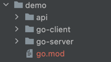

# dubbogo-cli-v2

> dubbo-go integration tool

## How to use

1. Install
```bash
go get -u github.com/dubbogo/tools/cmd/dubbogo-cli-v2
```
## The main function

### Get a list of interfaces and methods

```bash
./dubbogo-cli-v2 show --r zookeeper --h 127.0.0.1:2181
```
The output is as follows

```bash
interface: org.apache.dubbo.game.basketballService
methods: []
interface: com.apache.dubbo.sample.basic.IGreeter
methods: []
interface: com.dubbogo.pixiu.UserService
methods: [CreateUser,GetUserByCode,GetUserByName,GetUserByNameAndAge,GetUserTimeout,UpdateUser,UpdateUserByName]
interface: org.apache.dubbo.gate.basketballService
methods: []
interface: org.apache.dubbo.game.basketballService
methods: []
interface: com.apache.dubbo.sample.basic.IGreeter
methods: []
interface: com.dubbogo.pixiu.UserService
methods: [CreateUser,GetUserByCode,GetUserByName,GetUserByNameAndAge,GetUserTimeout,UpdateUser,UpdateUserByName]
interface: org.apache.dubbo.gate.basketballService
methods: []

```

### Create demo

```bash
./dubbogo-cli-v2 new --path=./demo
```

This command will generate a dubbo-go example, you can refer to the example [HOWTO](https://github.com/apache/dubbo-go-samples/blob/master/HOWTO.md) to run.


