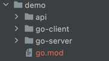

# dubbogo-cli-v2

> dubbo-go 集成工具

## 使用方式

1. 安装
```bash
go get -u github.com/dubbogo/tools/cmd/dubbogo-cli-v2
```
## 主要功能

### 获取接口及方法列表

```bash
./dubbogo-cli-v2 show --r zookeeper --h 127.0.0.1:2181
```
输出如下

```bash
interface: org.apache.dubbo.game.basketballService
methods: []
interface: com.apache.dubbo.sample.basic.IGreeter
methods: []
interface: com.dubbogo.pixiu.UserService
methods: [CreateUser,GetUserByCode,GetUserByName,GetUserByNameAndAge,GetUserTimeout,UpdateUser,UpdateUserByName]
interface: org.apache.dubbo.gate.basketballService
methods: []
interface: org.apache.dubbo.game.basketballService
methods: []
interface: com.apache.dubbo.sample.basic.IGreeter
methods: []
interface: com.dubbogo.pixiu.UserService
methods: [CreateUser,GetUserByCode,GetUserByName,GetUserByNameAndAge,GetUserTimeout,UpdateUser,UpdateUserByName]
interface: org.apache.dubbo.gate.basketballService
methods: []

```

### 创建 demo

```bash
./dubbogo-cli-v2 new --path=./demo
```

该命令会生成一个 dubbo-go 的样例，该样例可以参考 [HOWTO](https://github.com/apache/dubbo-go-samples/blob/master/HOWTO.md) 运行:



### 快速添加 hessian2 注册方法
#### main.go
```go
package main

//go:generate go run "github.com/dubbogo/tools/cmd/dubbogo-cli-v2" hessian --include pkg
func main() {

}
```
#### pkg/demo.go

```go
package pkg

type Demo0 struct {
	A string `json:"a"`
	B string `json:"b"`
}

func (*Demo0) JavaClassName() string {
	return "org.apache.dubbo.Demo0"
}

type Demo1 struct {
	C string `json:"c"`
}

func (*Demo1) JavaClassName() string {
	return "org.apache.dubbo.Demo1"
}

```

#### 执行 `go generate`

```shell
go generate
```

#### 日志
```shell
2022/01/28 11:58:11 === Generate start [pkg\demo.go] ===
2022/01/28 11:58:11 === Registry POJO [pkg\demo.go].Demo0 ===
2022/01/28 11:58:11 === Registry POJO [pkg\demo.go].Demo1 ===
2022/01/28 11:58:11 === Generate completed [pkg\demo.go] ===
```

#### 结果

pkg/demo.go

```go
package pkg

import (
	"github.com/apache/dubbo-go-hessian2"
)

type Demo0 struct {
	A string `json:"a"`
	B string `json:"b"`
}

func (*Demo0) JavaClassName() string {
	return "org.apache.dubbo.Demo0"
}

type Demo1 struct {
	C string `json:"c"`
}

func (*Demo1) JavaClassName() string {
	return "org.apache.dubbo.Demo1"
}

func init() {

	hessian.RegisterPOJO(&Demo0{})

	hessian.RegisterPOJO(&Demo1{})

}

```

#### 命令行参数

|  flag   |               description               |    default     |
|:-------:|:---------------------------------------:|:--------------:|
| include | Preprocess files parent directory path. |       ./       |
| thread |          Worker thread limit.           | (cpu core) * 2 |
| error |        Only print error message.        |     false      |

#### 如何一键引入其他依赖
在命令行输入 install all 可以直接引入本工具的其他依赖
输入install tripe 引入tripe协议依赖
输入install formatter 引入formatter协议依赖
输入install dubbo3grpc 引入dubbo3grpc协议依赖